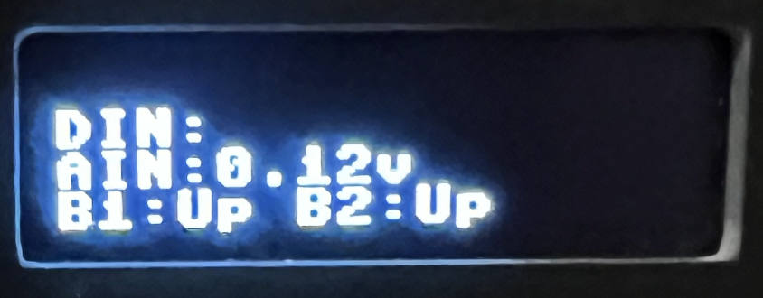

# EuroPi-Go

An alternative firmware for [EuroPi](https://github.com/Allen-Synthesis/EuroPi) written in the Go language, using TinyGo for embedded systems.



# Installation
To get started with EuroPi-Go, you need to install [TinyGo](https://tinygo.org/getting-started/).

Download this repository and navigate to the project directory and run `go mod tidy` to ensure all dependencies are installed.

# Run

To flash the firmware and apps to the EuroPi, you can use the following command:

```bash
tinygo flash -target=pico --monitor ./cmd/pico
```

If flashing fails, you may need to reset the EuroPi. 
- Unplug the USB cable then 
- Press and hold the reset button on the Pico device whilst re-connecting the USB cable.
- Release the reset button.
- Run the above flash command again

### To build the firmware without flashing:

Just to prove everything compiles, you can build the firmware without flashing it to the device:

```bash
tinygo build -target=pico ./cmd/pico
```

## Number of Display Lines

The EuroPi-Go firmware supports an easy way to write text to the display.

The default number of display lines is three, but you can change this to four by setting the `-lotslines` build tag before building or flashing the firmware:

```bash
tinygo flash -tags lotslines -target=pico --monitor ./cmd/pico
```
This will set the number of display lines to four, which is useful for displaying more information on the screen, however on a 32 pixel high display, there will be no space between lines, so it may be hard to read. The default is three lines, which gives a bit of space between each line.

## TinyFont Mode

This uses the TinyGo font library to write text to the screen, rather than the custom 8x8 font used in the original EuroPi firmware courtesy of MicroPython. The tinyfont mode doesn't look as good and is not recommended. However it can be tweaked to use a variety of fonts available from the [TinyGo font library](https://pkg.go.dev/tinygo.org/x/tinyfont@v0.6.0), which can be useful for displaying text in different styles.

```bash
tinygo flash -tags tinyfont -target=pico --monitor ./cmd/pico

# or just build without flashing
tinygo build -tags tinyfont -target=pico ./cmd/pico
```
The `-tags tinyfont` build flag is required to build the firmware to use the Tinyfont font. This is not a runtime flag, but a build-time flag.

## Mock Version

To run the mock version, which simulates the EuroPi hardware without needing the actual device, use the following command.

```bash
go run ./cmd/mock -tea
```

This will run the mock version of the EuroPi firmware, which simulates the hardware and allows you to interact with it as if it were a real device using a go routine which sets values on the mock hardware (see `cmd/mock/main.go`). The `-tea` flag enables a fancy bubbletea UI for the mock version.

Mock mode does not use build flags but rather command line flags to control the behavior of the mock UI. 
- The `-tinyfont` flag can be used to simulate the number of characters that fit on a line when using TinyFont mode on the hardware.
- The `-lotslines` flag can be used to simulate the number of lines on the display when using the `-lotslines` build tag on the hardware. Three or four lines can be displayed, depending on this flag.
- The `-tea` flag enables the fancy bubbletea UI, which provides a more interactive and visually appealing interface for the mock version. Otherwise the default mock behaviour is a chunk of text representing the display output emitted each time the display is updated. This is actually great for testing and debugging, as it allows you to see the output of the display without needing to run the actual hardware.

Example usages of the mock version:
```bash
go run ./cmd/mock
go run ./cmd/mock -lotslines
go run ./cmd/mock -tea
go run ./cmd/mock -tea -lotslines
go run ./cmd/mock -tea -tinyfont
go run ./cmd/mock -tea -tinyfont -lotslines
```

Note any logging will be logged to file `mock.log` in the project root directory.

Example mock output:

```
┌─────────────────────────┐
│Knob1: 0    DIN:         │
│Knob2: 0    AIN:0.00v    │
│B1:Down B2:Down          │
└─────────────────────────┘
```

# Developing

Set `.vscode/settings.json` to use the `tinygo` build tag for development:

```bash
{
  "go.buildTags": "tinygo"
}
```

When actively developing the firmware, so that the TinyGo build tags are set correctly. Tinygo compiler will ALWAYS use the `tinygo` build tag anyway, so its not really necessary - but it makes vscode behave better re intellisense and code navigation.

You will get squiggly lines in vscode for some lines in the other mode (tinygo or !tinygo), but they are not errors, just warnings that the code is not compatible with the standard Go compiler. You can ignore them.

When you are in mock mode including the running of tests, you should disable the `tinygo` build tag in `.vscode/settings.json`, something like this:

```json
{
  "go.buildTags": "tinygoX"
}
```

Or just remove the line with `go.buildTags` completely, as it is not needed for mock mode.

# Testing

To run tests, you can use the following command:

```bash
go test ./...
```

or for just the display package:

```bash
go test ./display
```

You can also use the Test Explorer in VSCode to run tests interactively.  

> Remember to disable the `tinygo` build tag in `.vscode/settings.json` if you are running tests (see discussion above e.g. `"go.buildTags": "tinygoXX"`).

# License

This project is licensed under the MIT License - see the [LICENSE](LICENSE) file for details.

